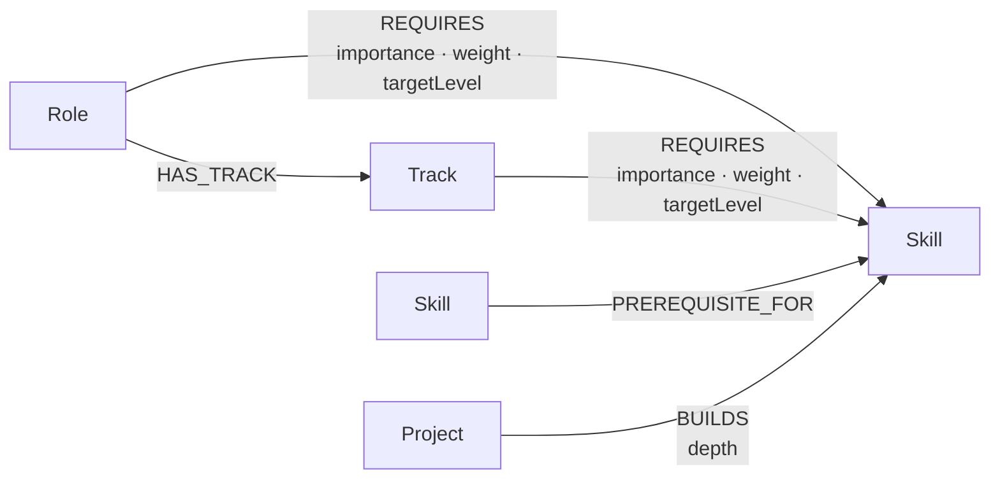

# PathForge

**Turn your current skills into a clear route to your next tech role.**

PathForge is an explainable tech career navigator: choose a target role, select what you already
know, and see the graph connections behind your readiness score, skill gaps, learning sequence,
portfolio projects, and nearby roles.

> [!NOTE]
> The application is prepared for CognoDB, but a live instance is intentionally not bundled with
> the repository. Live connectivity, seeded production data, screenshots, a hosted Render demo,
> and a screen recording must be completed and verified by the author before submission.

## Product overview

Career advice often produces a list without showing why it applies. PathForge models roles,
skills, prerequisites, and portfolio projects as a connected graph. Each recommendation includes
the relationships that produced it, so an early-career professional can understand what they
already cover, what to learn next, and what to build to demonstrate it.

The browser experience provides:

- A guided target-role and current-skill planner.
- A weighted readiness score with matched, core-missing, and supporting-missing skills.
- Ordered learning paths through skill prerequisites, including paths of several hops.
- Portfolio projects ranked by how many important gaps they cover.
- Alternative roles reached through shared skill neighborhoods.
- An interactive, filterable Cytoscape graph with node details and relationship legend.
- Explicit loading, empty, validation, not-configured, unavailable, and unexpected-error states.
- A plain-language explanation of the data model and scoring method.

## Why a graph database?

The useful questions are about connections and paths, not isolated records:

- Which skills does a role require, and with what importance?
- Which other roles share those skills?
- What prerequisite chain connects a known skill to a missing one?
- Which project covers several high-weight gaps at once?
- What exact evidence explains a recommendation?

In a relational design, roles, skills, projects, and prerequisites require several junction tables.
Shared-skill recommendations require repeated joins, while variable-depth prerequisite paths need
a recursive common-table expression with explicit path bookkeeping and cycle protection. CognoDB
expresses the central learning-path question directly as a bounded relationship traversal:

```cypher
[:PREREQUISITE_FOR*1..4]
```

The returned path is both the computation and the explanation shown to the user. CognoDB supports
openCypher over Bolt, so PathForge uses the official Neo4j JavaScript driver without APOC, Graph
Data Science, an ORM, or Neo4j-specific runtime plugins.

## Graph data model



Relationship direction is deliberate: `(foundation)-[:PREREQUISITE_FOR]->(advanced)` means the
source should generally be learned before the target.

| Label     | Stable identity | Important properties                                            |
| --------- | --------------- | --------------------------------------------------------------- |
| `Role`    | `slug`          | `name`, `summary`, `category`, `experienceLevel`, `description` |
| `Track`   | `slug`          | `name`, `summary`, `category`, `description`, `parentRoleSlug`   |
| `Skill`   | `slug`          | `name`, `category`, `description`, `difficulty`                 |
| `Project` | `slug`          | `name`, `summary`, `difficulty`, `estimatedHours`, `category`   |

| Relationship                           | Meaning                             | Properties                                  |
| -------------------------------------- | ----------------------------------- | ------------------------------------------- |
| `(Role)-[:HAS_TRACK]->(Track)`         | A role exposes optional specializations | —                                       |
| `(Role)-[:REQUIRES]->(Skill)`          | A role depends on a skill           | `importance`, `weight` (1–5), `targetLevel` |
| `(Track)-[:REQUIRES]->(Skill)`         | A specialization adds track requirements | `importance`, `weight` (1–5), `targetLevel` |
| `(Skill)-[:PREREQUISITE_FOR]->(Skill)` | Learn the source before the target  | —                                           |
| `(Project)-[:BUILDS]->(Skill)`         | A project gives practice in a skill | `depth`                                     |

API graph nodes use stable public IDs such as `Role:backend-developer` and `Skill:sql`; database
internal IDs are never exposed as application identities.

## Architecture

```text
React + Vite browser application
          │  JSON over /api (native fetch)
          ▼
Express routes → validation → services → parameterized query module
          │                         │
          │ production static files│ official neo4j-driver / Bolt TLS
          ▼                         ▼
    client/dist                 CognoDB Cloud
```

During development, Vite and Express run together and the client proxies API traffic. In
production, Vite builds static assets and the compiled Express process serves both `/api` and the
single-page application. The SPA fallback does not intercept API routes. The database driver is
created lazily and reused; each session is closed in `finally`, and the process closes the driver
on graceful shutdown.

Business transformations—most notably readiness scoring—stay in the service layer so they remain
small, explainable, and testable without a live database. Query text lives separately from request
handling, and every dynamic Cypher value is passed as a parameter.

## Technology stack

| Area                 | Technology                                                          |
| -------------------- | ------------------------------------------------------------------- |
| Monorepo             | npm workspaces, concurrently, TypeScript strict mode                |
| Client               | React, React Router, Vite, Tailwind CSS, Cytoscape.js, Lucide React |
| Server               | Node.js 20+, Express, Zod, helmet, cors, dotenv                     |
| Database             | CognoDB Cloud over Bolt TLS, official `neo4j-driver`                |
| Tests                | Vitest, React Testing Library, jsdom, Supertest                     |
| Quality and delivery | ESLint, Prettier, GitHub Actions, Render blueprint                  |

## Repository structure

```text
pathforge-cognodb/
├── .github/workflows/ci.yml       # credential-free Node 20 verification
├── client/
│   ├── src/
│   │   ├── api/                   # typed fetch boundary
│   │   ├── components/            # reusable UI states and controls
│   │   ├── features/              # planner, roadmap, and graph UI
│   │   ├── hooks/                 # persisted planner/database state
│   │   ├── pages/                 # landing, planner, explorer, model
│   │   └── types/                 # client API contracts
│   └── package.json
├── server/
│   ├── src/
│   │   ├── config/                # validated environment state
│   │   ├── db/                    # driver, queries, seed data, seed runner
│   │   ├── errors/                # typed operational errors
│   │   ├── middleware/            # error and not-found handling
│   │   ├── routes/                # health, catalog, analysis, graph
│   │   ├── services/              # scoring and response transformations
│   │   ├── app.ts                 # Express composition
│   │   └── server.ts              # listener and graceful shutdown
│   ├── tests/
│   ├── .env.example
│   └── package.json
├── docs/screenshots/README.md      # honest post-database capture checklist
├── AGENTS.md                       # repository engineering guardrails
├── render.yaml                     # one Render web service
└── package.json                    # workspace orchestration
```

## Prerequisites

- Node.js 20 or newer and the npm version bundled with it.
- A CognoDB Cloud c0 instance only when seeding or testing real graph requests.
- No local Neo4j installation, Docker database, APOC, or GDS plugin is required.

Confirm the local toolchain with:

```bash
node --version
npm --version
```

## Installation

From the repository root:

```bash
npm ci
```

`npm ci` installs both workspaces from the committed lockfile. Use `npm install` only when
intentionally changing dependencies and updating that lockfile.

## CognoDB Cloud setup and environment variables

1. Create a CognoDB c0 instance in the CognoDB Cloud console.
2. Copy the instance's Bolt TLS URI, shaped like
   `bolt+s://<instance-id>.databases.cognodb.cloud`.
3. Copy the example file from the repository root:

   ```powershell
   Copy-Item server/.env.example server/.env
   ```

   On macOS or Linux, use `cp server/.env.example server/.env`.

4. Edit **`server/.env`** (never commit it):

   ```dotenv
   COGNODB_URI=bolt+s://your-instance-id.databases.cognodb.cloud
   COGNODB_USERNAME=cognodb
   COGNODB_PASSWORD=replace-with-your-password
   PORT=3000
   NODE_ENV=development
   CLIENT_ORIGIN=http://localhost:5173
   ```

The server can start without the first three values. `/api/health` then reports
`database.status: "not_configured"`, and data routes return an explicit service error instead of
inventing successful data. A configured instance that cannot be reached reports `unavailable`.
Credentials remain exclusively in the server process and are never placed in Vite variables,
responses, or logs.

## Running locally

Start the client and API together:

```bash
npm run dev
```

The default development URLs are `http://localhost:5173` for Vite and
`http://localhost:3000/api/health` for the API. You can also run a single workspace:

```bash
npm run dev --workspace client
npm run dev --workspace server
```

Build and run the production-shaped application locally:

```bash
npm run build
npm start
```

## Loading seed data

After `server/.env` contains real CognoDB credentials:

```bash
npm run seed
```

Optional pre-check (non-destructive) before seeding:

```bash
npm run dev --workspace server
# then open /api/health and confirm database.status is connected
```

The seed data is maintained as readable TypeScript objects. The runner validates configuration,
connects through the official driver, creates nodes before relationships, and uses parameterized
`UNWIND $items` batches with `MERGE`. Re-running it updates stable identities without duplicating
nodes or relationships. It does **not** erase the database. Sessions and the driver close in
`finally`, and a failed seed exits nonzero.

Before adding prerequisite edges, the seed model is checked for duplicate or invalid slugs,
self-links, dangling references, and obvious prerequisite cycles.

## API

| Method and path                  | Purpose                                                                                    |
| -------------------------------- | ------------------------------------------------------------------------------------------ |
| `GET /api/health`                | Application health and safe `connected`, `unavailable`, or `not_configured` database state |
| `GET /api/roles`                 | Roles ordered for target selection                                                         |
| `GET /api/roles/:roleSlug/tracks` | Role-scoped specialization tracks (including empty arrays for general-only roles)         |
| `GET /api/roles/:roleSlug/requirements?trackSlug=<slug>` | Combined requirements for the general role or a selected specialization track |
| `GET /api/skills`                | Skills ordered/groupable by category and name                                              |
| `POST /api/analysis`             | Weighted readiness, gaps, learning paths, projects, and similar roles                      |
| `GET /api/graph/roles/:roleSlug` | Bounded role/skill/prerequisite/project graph for Cytoscape                                |

Analysis input is strict and bounded. The API accepts both the legacy payload and the newer proficiency-aware payload.

Legacy-compatible request:

```json
{
  "targetRoleSlug": "backend-developer",
  "currentSkillSlugs": ["python", "sql", "git"]
}
```

Proficiency-aware request:

```json
{
  "targetRoleSlug": "backend-developer",
  "targetTrackSlug": "python-fastapi-backend",
  "currentSkills": [
    { "skillSlug": "python", "proficiency": "project" },
    { "skillSlug": "sql", "proficiency": "comfortable" },
    { "skillSlug": "git", "proficiency": "learning" }
  ]
}
```

Duplicate skill slugs are normalized. Missing or malformed input returns `400`, an unknown target
returns `404`, and unavailable/not-configured database access returns `503` through a consistent,
safe error envelope.

## Main Cypher queries

The query module contains the complete projection details; these shortened forms show the graph
shapes and parameter boundaries. No user-controlled value is interpolated into query text.

### Query A: list roles

```cypher
MATCH (role:Role)
RETURN role
ORDER BY role.name
```

This supplies role selection directly from CognoDB rather than bundling runtime catalog data in the
frontend.

### Query B: list skills

```cypher
MATCH (skill:Skill)
RETURN skill
ORDER BY skill.category, skill.name
```

Category/name ordering supports the grouped, searchable skill selector.

### Query C: role requirements and readiness inputs

```cypher
MATCH (target:Role {slug: $targetRoleSlug})-[requirement:REQUIRES]->(skill:Skill)
RETURN skill,
       requirement.importance AS importance,
       requirement.weight AS weight,
       requirement.targetLevel AS targetLevel,
       skill.slug IN $currentSkillSlugs AS matched
ORDER BY requirement.weight DESC, skill.name
```

The query returns evidence; the service calculates the percentage so rounding and empty-denominator
behavior are straightforward to unit test.

### Query D: similar roles through an explicit two-hop query

```cypher
MATCH (target:Role {slug: $targetRoleSlug})-[:REQUIRES]->(skill:Skill)<-[:REQUIRES]-(other:Role)
WHERE other.slug <> target.slug
RETURN other, count(DISTINCT skill) AS sharedSkillCount, collect(DISTINCT skill) AS sharedSkills
ORDER BY sharedSkillCount DESC, other.name
LIMIT 6
```

The `Role → Skill ← Role` pattern crosses two relationships. It discovers alternatives by their
actual shared neighborhood rather than a manually maintained “similar role” flag, and returns the
shared skills as the explanation.

### Query E: variable-length prerequisite paths

```cypher
MATCH (target:Role {slug: $targetRoleSlug})-[:REQUIRES]->(needed:Skill)
MATCH path = (current:Skill)-[:PREREQUISITE_FOR*1..4]->(needed)
WHERE current.slug IN $currentSkillSlugs
RETURN path
LIMIT 50
```

The bounded `*1..4` traversal finds prerequisite chains of different depths without APOC. Results
are normalized into ordered steps; the service can choose sensible shortest paths when several
exist. When no current skill is selected, foundation-level missing skills become starting points.
When no path exists, the UI labels the missing skill as a direct learning target instead of hiding
it.

In SQL, the same variable-depth question needs a recursive CTE that repeatedly joins a
skill-prerequisite table, tracks visited IDs to prevent cycles, maintains an ordered path, enforces
a depth cap, and finally joins role requirements. The graph traversal states the intended
relationship directly, and its path can be returned for visualization.

### Query F: project recommendations

```cypher
MATCH (target:Role {slug: $targetRoleSlug})-[requirement:REQUIRES]->(missing:Skill)
WHERE NOT missing.slug IN $currentSkillSlugs
MATCH (project:Project)-[practice:BUILDS]->(missing)
RETURN project,
       count(DISTINCT missing) AS coveredSkillCount,
       sum(requirement.weight) AS coveredWeight,
       collect(DISTINCT missing) AS coveredSkills
ORDER BY coveredSkillCount DESC, coveredWeight DESC, project.name
LIMIT 6
```

Each card can therefore say which gaps it covers and why it outranks another project.

### Query G: role graph neighborhood

```cypher
MATCH (role:Role {slug: $targetRoleSlug})-[requirement:REQUIRES]->(required:Skill)
OPTIONAL MATCH prerequisitePath =
  (prerequisite:Skill)-[:PREREQUISITE_FOR*1..2]->(required)
OPTIONAL MATCH (project:Project)-[practice:BUILDS]->(required)
RETURN role, requirement, required, prerequisitePath, project, practice
LIMIT 200
```

The graph endpoint composes a bounded neighborhood around `$targetRoleSlug`: required skills, up to
two prerequisite levels, and relevant projects. Database values are transformed into Cytoscape
DTOs with stable `Label:slug` IDs and typed edges; Neo4j integer objects are converted before JSON
serialization. Bounds keep the visualization and free-tier query cost predictable.

## Readiness-score calculation

Each `REQUIRES` relationship has an integer weight from 1 to 5.
PathForge computes proficiency-adjusted readiness using:

$$
	ext{readiness} = \mathrm{round}_{1\text{dp}}\left(\frac{\sum (w_i \times f_i)}{\sum w_i} \times 100\right)
$$

Where $f_i$ is based on selected proficiency:

- `learning` = $0.35$
- `comfortable` = $0.70$
- `project` = $1.00$
- not selected = $0.00$

PathForge also reports strict matched weight (`project` only) separately for explainability.

Equivalent code-level formula:

```text
readiness = round_to_1_decimal(
  (sum of requirement weight × proficiency factor / sum of requirement weights) × 100
)
```

For example, with weights `5, 3, 2` and factors `1.0, 0.7, 0.35`, readiness is
$\frac{(5\times1.0)+(3\times0.7)+(2\times0.35)}{10}\times100=78.0\%$.
A role with no requirements returns `0%` rather than dividing by zero. `importance` controls the
core/supporting presentation; it does not secretly replace the documented numeric weight.

## Error handling, security, and reliability

- Zod validates environment state and strict, bounded request bodies.
- Helmet, a limited JSON body size, and environment-aware CORS protect the HTTP boundary.
- All Cypher values are parameterized, graph traversal depth is bounded, and no ORM is used.
- Driver creation is lazy and shared; read/write work is separated and sessions always close.
- Neo4j integers are normalized recursively before API serialization.
- Health remains HTTP `200` while the application runs, but reports the true database state.
- Operational database failures use `503`; validation uses `400`; unknown resources use `404`.
- Central middleware hides stack traces and unexpected details in production.
- `SIGINT` and `SIGTERM` stop the HTTP server and close the database driver.
- Secrets are ignored, never logged, never embedded in the client, and absent from CI.

Tests mock the database/service boundary; they do not silently substitute successful seed data in
the production application.

## Testing and verification

No CognoDB credentials are required for static checks, unit tests, API error tests, or builds:

```bash
npm run lint
npm run typecheck
npm test
npm run build
```

Run the full handoff gate with:

```bash
npm run verify
```

Focused verification commands:

```bash
npm run test --workspace client
npm run test --workspace server
npm run test --workspace server -- seed-data.test.ts
```

The server tests cover readiness math (including division by zero), duplicate normalization, Zod
validation, database-not-configured behavior, safe error formatting, recommendation transforms,
and Neo4j integer normalization. Client tests focus on loading/unavailable states, skill selection,
readiness rendering, and empty roadmap/project states.

GitHub Actions repeats `npm ci`, lint, typecheck, tests, and the production build on pushes and pull
requests using Node 20. It receives no fake or real CognoDB secrets.

## Render deployment

[`render.yaml`](render.yaml) defines one Node web service; it does not provision an unrelated
relational database.

1. Push the reviewed repository to a Git host.
2. In Render, create a Blueprint from the repository.
3. Enter `COGNODB_URI`, `COGNODB_USERNAME`, and `COGNODB_PASSWORD` when prompted. They are declared
   with `sync: false`, so the blueprint does not store values.
4. Confirm `NODE_ENV=production`. Render supplies `PORT`; do not hardcode it.
5. Deploy, open `/api/health`, and confirm `database.status` is `connected`.
6. Run the seed command once against the intended instance from a trusted environment, then test
   the planner and graph manually.

The Render build runs `npm ci && npm run build`; the start command runs the compiled Express app,
which binds to `0.0.0.0` and Render's `PORT`. Free services can cold-start, so open the demo shortly
before evaluation or recording and wait for health to recover.

## Screenshots

Screenshots are deliberately pending. The capture names, states, viewport guidance, and honesty
requirements live in [`docs/screenshots/README.md`](docs/screenshots/README.md):

- Landing page
- Planner selection
- Analysis result
- Learning roadmap
- Graph explorer
- Database error state

Add images here only after the real database-backed flow is manually verified.

## Screen-recording checklist

- [ ] Open the deployed app shortly beforehand to account for a possible Render cold start.
- [ ] Show the landing proposition and briefly explain why connections make this a graph problem.
- [ ] Choose a role and several current skills; show search, grouping, and persisted selection.
- [ ] Run analysis and explain the weighted score, matched/core/supporting gaps, and empty handling.
- [ ] Follow a multi-hop learning path and connect it to `PREREQUISITE_FOR` direction.
- [ ] Explain why a recommended project covers several weighted missing skills.
- [ ] Show an alternative role reached through the `Role → Skill ← Role` traversal.
- [ ] Use graph filters, fit/reset, node selection, legend, and the details panel.
- [ ] Show `/api/health` and state whether the live CognoDB connection was actually verified.
- [ ] Mention parameterized Cypher, environment-only credentials, graceful failure, and test results.
- [ ] Keep credentials, personal notifications, and private browser content out of frame.

## Trade-offs and design decisions

- **Explainability over opaque prediction:** curated relationship weights and paths are inspectable;
  no LLM or external recommendation API is used.
- **Portable openCypher:** bounded native traversals avoid APOC, GDS, and database-specific helpers.
- **Service-layer scoring:** Cypher returns evidence while TypeScript owns documented math and
  deterministic rounding.
- **One deployable service:** Express serves the built SPA and API, reducing configuration and CORS
  complexity for a take-home deployment.
- **No global client state library:** URL/router state, local component state, and validated local
  storage are sufficient for this workflow.
- **Readable seed objects:** a moderate curated dataset is easier to review and defend than a
  generated bulk fixture. `MERGE` prioritizes safe repeatability over destructive reset speed.
- **Bounded recommendations:** limits and traversal depths keep responses legible and appropriate
  for a small CognoDB tier, at the cost of not exploring arbitrarily deep curricula.
- **Database-independent tests:** fast deterministic tests validate transformations and failure
  behavior; a real CognoDB smoke test remains a manual post-provisioning step.

## Current limitations and future improvements

Until the author completes the external setup, live CognoDB connectivity, seed execution against
CognoDB, Render behavior, screenshots, and recording remain unverified. Recommendations depend on
the quality of the curated taxonomy and weights, not labor-market data.

Useful next iterations include:

- An authoring/review workflow for versioned role requirements and prerequisite evidence.
- Optional proficiency levels instead of binary known/not-known skill selection.
- Outcome feedback that improves weights while preserving an audit trail.
- More accessible graph alternatives, such as an equivalent expandable relationship list.
- CognoDB-backed integration smoke tests in an explicitly configured, secret-protected environment.
- Side-by-side multi-target comparison, saved plans, and printable learning roadmaps.

## Comparison workflow today

PathForge currently supports role comparison through two explainable planner pathways:

- Similar-role cards returned from shared requirement neighborhoods.
- One-click `Use as target` navigation that preserves the current skill profile and reruns analysis.

This keeps comparisons evidence-backed while avoiding hidden scoring branches.

## AI-assistance disclosure

This project was developed with assistance from an AI coding tool. Architecture, data modeling,
implementation choices, and final code were reviewed by the author, who can explain and defend the
submission.

## Author

**Name:** _Add your name_  
**Email:** _Add your professional email_  
**Portfolio / GitHub:** _Add your link_
